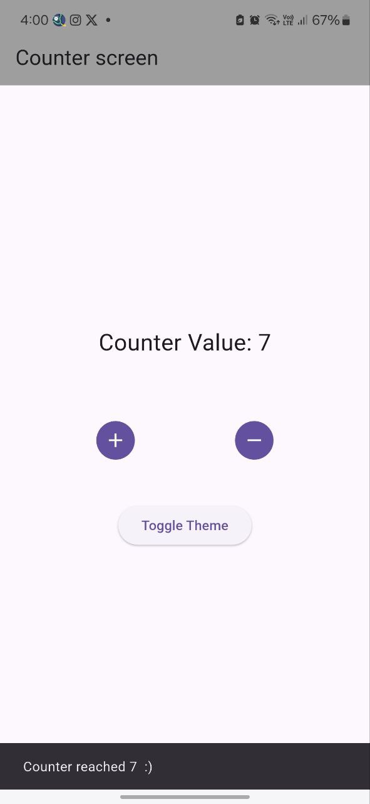
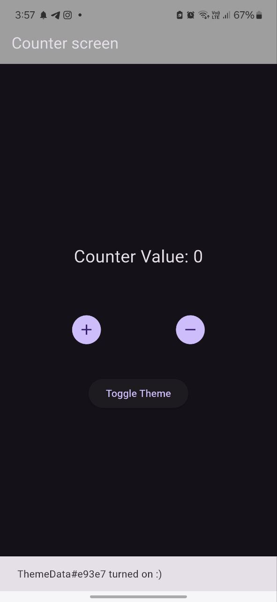

# sprints_bloc_intro

A new Flutter project.

## Getting Started

Dealing with different Types of Blocs.
Create two different BLoCs

1. A CounterBloc to handle integer value
2. A ThemeBloc to toggle between light and dark themes.

## 📸 Screens

    
    

